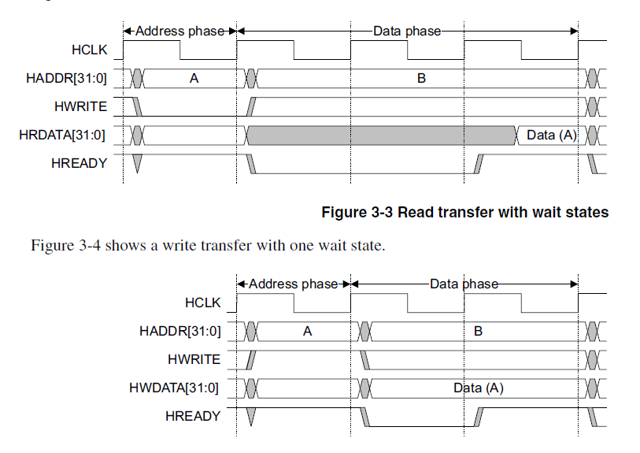

# 1 整体连接结构

one master multiple slaves. 

需要多个master的话 需要多层连接。（x）

四个东西：master slave decoder multiplexor

# 2 传输

## 2.1 信号规定

需要解释的

**master:-> slave**

**HWDATA**

HBURST: 规定burst模式, 4 8 16 beats wrap or increment

HSIZE: 表示一次使用data总线的大小, 单次时钟周期传输多少数据

HTRANS: 主机传输状态 BUSY 表示一种主机的挂起

**slave:->multiplexor：-》 MASTER**

**HRDATA;**

HREADY： 高的时候表示

HRESP: 报错：之后再说

## 2.2 传输细则

全部：分成两个阶段。addr, data 

所有触发都在时钟的上升沿

addr：assert address and control HWRITE(高写低读)

>流水线
slave通过HREADY低，来请求等待。

MASTERLOCK 主要用于多master的情况来锁定多周期的通信。

HSIZE: 数据总线的宽度是最大值。小于32bits的传输，需要约定高位地位 endiness

## 2.3 burst 模式

single（普通，b000）

**wrap burst 回环传输（4,8,16）**

根据HSIZE 计算大小，做地址对齐，

**increment burst 递增传输（多一个未定长度模式）**

配置HBURST, HSIZE。 HTRANS 第一周期挂 NONSEQ，从第二周期开始挂SEQ

## 2.4 传输中的等待 waiting

slave  HREADY 低 

master 可以从idle 到nonseq

busy-》nonseq 中断burst 重新开始

busy-》seq

>BUSY
>没有数据需要传输。这个信号可以在突发传输中，用来插入空闲的CYCLE，表示主机在忙，也就是说传输还在继续，但是处于暂停状态。在不指定突发长度的情况下，在最后一拍用BUSY去传输，来表明这是Burst的最后一笔，这一鸡肋的机制被AXI的LAST信号完美替代。实际上BUSY这个状态很少见，在CORTEX-M系列基本上不会有这个BUSY状态，在大部分情况下都是使用NONSEQ和SEQ传输类型，因此可以暂时不去掌握该类型
>

## 2.5 HRESP

The two-cycle response is required because of the pipelined nature of the bus. By the time a slave starts to issue an ERROR response then the address for the following transfer has already been broadcast onto the bus. The two-cycle response provides sufficient time for the master to cancel this next access and drive HTRANS[1:0] to IDLE before the start of the next transfer.

但是ERROR response需要两个时钟周期。（这是由于总线的流水线特性决定的，当slave发出ERROR响应时，下一个传输的地址已经被广播到总线上了。two-cycle响应给master提供了足够的时间取消下一次访问并将HTRANS [1：0]驱动到IDLE。）

# 拓展资料？学习资料？

[AMBA学习 - 知乎 (zhihu.com)](https://www.zhihu.com/column/c_1663245806869291008)

[AHB总线协议 + AHB_SRAM代码实现（1）_哔哩哔哩_bilibili](https://www.bilibili.com/video/BV1rN41187EE/)

## 关于仲裁

[第六章.总线_哔哩哔哩_bilibili](https://www.bilibili.com/video/BV1wR4y1S7bB/) 这个是关于总线的一般知识

关于多对多的AHB  如何仲裁，下次学。

