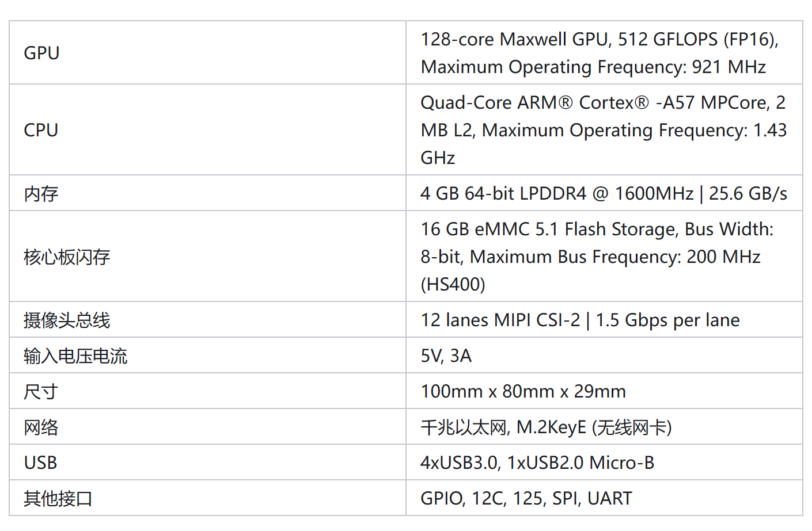
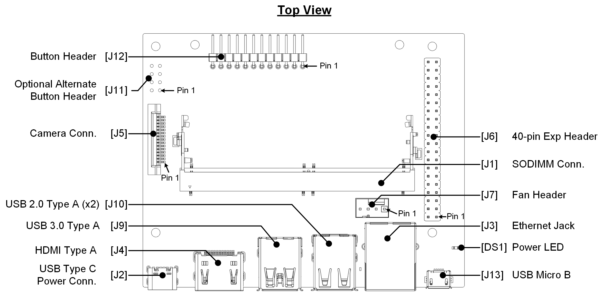
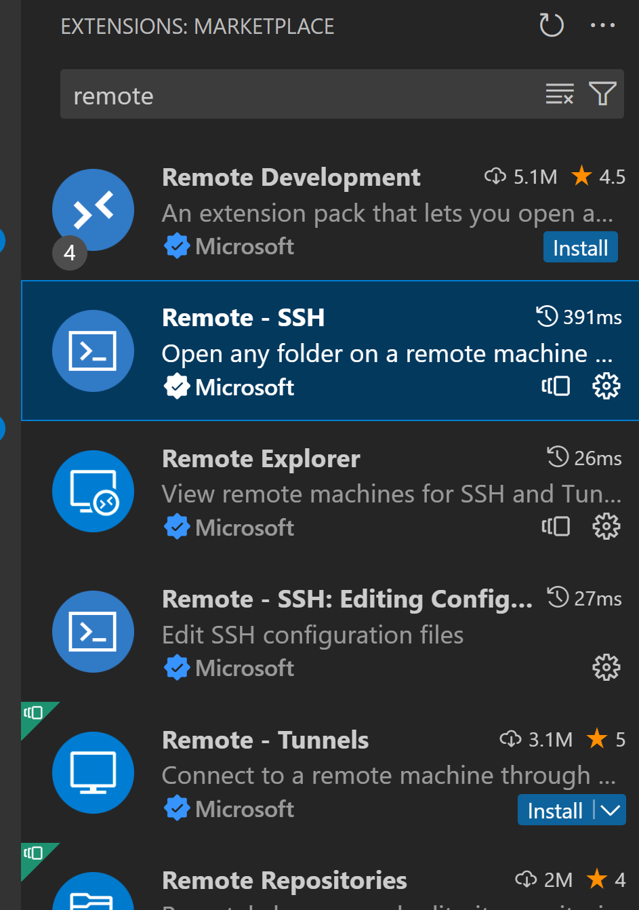
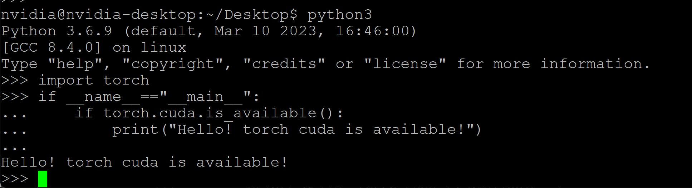

# nano
Official Guideline:
https://developer.nvidia.com/embedded/learn/get-started-jetson-nano-devkit
Jetson Nano User Manual:
https://developer.nvidia.com/embedded/learn/jetson-nano-2gb-devkit-user-guide
Hardware Parameters:
<div align="center">

</div>
<div align="center">

</div>

ZhiHu Column:
https://zhuanlan.zhihu.com/p/632057827


## 0. System Setup
### 0.1 SD card overwrite
You need balenaEtcher to write system image to SD card.
https://etcher.balena.io/#download-etcher
You shall create image following instructions on nano website or use pre-set image from disk.

### 0.2 Boot amd Control
#### 0.2.1 serial boot (headless mode, no monitor)
Wiring Instructions, 2 alternatives.
- Micro-USB Power Supplied (Remove the J48 Power Select Header pins jumper): Connect micro-USB to PC's USB port with power supply; no additional power input in need.
- DC 5V-3A Power Supplied (Jumper the J48 Power Select Header pins): Connect to PC's USB port with/without power supply; additionally connect DC wire to 5V power jack.

Serial Communication.
https://developer.nvidia.com/embedded/learn/get-started-jetson-nano-devkit#setup
- For Windows.
    1. Locate device COM port in `Device Manager`.
    2. Write down the COM number. 
    <div align="center">
    
    </div>
    3. Download and execute `Putty`.
    https://www.chiark.greenend.org.uk/~sgtatham/putty/latest.html
    4. enter COM number and baud rate into the blanket and open.
    <div align="center">
    
    </div>
    5. Finally, log in.
- For MACOS (Linux).
    1. Before connecting to your Jetson developer kit for initial setup, check to see what Serial devices are already shown on your macOS computer.
    ```bash
    # macOS
    ls /dev/cu.usbmodem*
    # Ubuntu
    ls /dev/ttyACM*
    ```
    The new device is your nano.
    2. screen operation.
    ```bash
    sudo screen /dev/cu.usbmodem14133200001053 115200
    sudo screen /dev/ttyACM0 115200
    ```

- Serial File Transportation
Without network connection, the device is directly accessible via IP address `192.168.55.1` with serial connection.

#### 0.2.2 Monitor Mode
Connect your nano to a monitor and control it as if you are controling an ordinary computer.

#### 0.2.3 ssh remote connection
1. Make sure your PC are in the same intra-net as your nano, i.e., using the same router/WIFI (attention: large wifi with layer-3 switches are not acceptable).
2. On your nano, check `ifconfig`. And you can see nano's IPv4 address. Replace "xxx.xxx.xxx.xxx" with IPv4 address.
```bash
ssh -p 22 nvidia@xxx.xxx.xxx.xxx
```
Also, scp is possible.
```bash
scp -P 22 file_name nvidia@xxx.xxx.xxx.xxx:/remote/directory
```

## 1. Networking
We connect to WIFI with Network Manager CMI (Command Line Interface), which functions just the same as the GUI interface on the up-right corner of Ubuntu.
```bash
# see available wifi
nmcli dev wifi list
# connect to a wifi with WPA/WPA2 authentication
sudo nmcli dev wifi con "WIFI-NAME" password "WIFI-PASSWORD"
```

Then, you can ping www.sjtu.edu.cn to see if networking is okay.
```bash
ping www.sjtu.edu.cn
```
Ctrl+C interrupt if response is detected.

You can see your internet configurations via:
```bash
ifconfig
iwconfig
```

## 2. File System
See the disk FS capacity with command `df -H`. If your SD card is 32GB, but only less than 16GB is shown, you need `parted` to enlarge your space to maximum possible.

```bash
# see capacity
df -H
sudo fdisk -l

# repart the disk.
sudo apt-get install parted
sudo parted

# in parted cli, resize dev/sda1 part.
print
select dev/sda
resizepart
# operate
print

# Now, fs not changed yet. resize2fs
sudo resize2fs /dev/sda1
df -H
```

Now, your system is ready to run.

## 3. Fan & Cooling
```bash
sudo vim /etc/rc.local

# write the following to the file. 
#!/bin/bash
sudo sh -c 'echo 100 > /sys/devices/pwm-fan/target_pwm'

# change mode to executable
sudo chmod 755 /etc/rc.local
```

## 4. Hello World in C
Compile your first C program.
1. directory
```bash
sudo apt-get install gcc g++ make cmake
cd Desktop
mkdir gkc2a
cd gkc2a
mkdir lesson1
touch hi.c
vim hi.c
```

2. coding
Press i to activate `Insert` mode.
```C
#include <stdio.h>
int main(){
    printf("Hello Embedded World!\n");
    return 0;
}
```
`Esc` to back to normal mode.
`:w` to save, `:q` to quit, `:wq` save and quit, `:q!` quit without save

3. Compile and Run
```bash
gcc -o hi hi.c
./hi
```

## 5. Hello Array in Python
```bash
# download dependencies
sudo apt-get update
sudo apt-get install python3-pip
# now you have a system level python-3.6

# add tsinghua mirror to pip
sudo vim /etc/pip.conf
[global]
index-url=https://pypi.tuna.tsinghua.edu.cn/simple

# install packages
pip3 install Cython==0.29.21 
pip3 install numpy==1.19.5
# it takes a long time (10 min), shall perform it after class.

# see installed version
pip3 freeze | grep numpy
pip3 show numpy
```

Your first python program.
```python
import numpy as np

arr = np.array(["Hello", "Embedded", "World!"])
print(arr, " ".join(arr.tolist()), sep="\n")
```

## 6. Get Familiar With CPU & Disk Resources
Get familiar to Nano device resources.
```bash
# see memory and process
sudo apt install htop
sudo htop
sudo ps -a
sudo ps -e
sudo ps -e | grep python3
pstree
# see disk resources
df -H
sudo fdisk -l
```

## 7. GitHub
1. download git.
```bash
sudo apt install git
```
2. Vscode remote
You shall install the `Remote SSH` extension in vscode first.
<div align="center">

</div>

```
Host Nano0xx
    HostName 192.168.1.xxx
    User nvidia
```

You shall change HostName every time you connect to network again. (see it though ifconfig on-board via serial/monitor).

3. Try git clone a repository
```bash
git clone https://github.com/huangzhengxiang/EdgeDeployment.git
```

4. Try create a private repo and then push it to the cloud.
```bash
cd /home/nvidia/Desktop
mkdir toy-repo && cd toy-repo
git init
touch README.md && echo "Hello Embedded World!\n" > README.md
git add .
git commit -m "initial commit"
git branch -M main
# create a repo
git remote add origin https://github.com/account/repo.git
git push origin main:main
```

## 8. PyTorch Installation
PyTorch for Jetson shall be downloaded from [PyTorch for Jetson](https://forums.developer.nvidia.com/t/pytorch-for-jetson/72048), the version number of `PyTorch v1.10.0`.
(You may need an oversea VPN if you're in China.)

Then, you send the file to nano via scp and install it on your nano. 
```bash
scp -P 22 /path/on/your/pc/torch-1.10.0-cp36-cp36m-linux_aarch64.whl nvidia@192.168.xxx.xxx:/home/nvidia/Desktop
# First, you install dependencies.
sudo apt-get install libomp5 libomp-dev libopenmpi2 libopenblas-dev
pip3 install torch-1.10.0-cp36-cp36m-linux_aarch64.whl
```

Run the following code to see if torch is ready.
```python
import torch
if __name__=="__main__":
    if torch.cuda.is_available():
        print("Hello! torch cuda is available!")
```
If torch is ready, you will see the following picture:
<div align="center">

</div>

## 9. Torchvision & Opencv Installation
```bash
git clone --branch release/0.11  https://github.com/pytorch/vision torchvision
# dependencies
sudo apt-get install libjpeg-dev zlib1g-dev
pip3 install 'pillow<9'
# install
cd torchvision/
sudo python3 setup.py install
```

```bash
pip3 install scikit-build
pip3 install opencv-python
```

## 10. Nano Resources Monitoring
You can also install nano specific resource monitor.
First, append the following line of configuration into `~/.bashrc`
```bash
export TERM='xterm-256color'
```

Then, update jtop.
```bash
sudo -H pip3 install jetson-stats
sudo systemctl restart jtop.service
```

Finally, initate jtop.
```bash
sudo jtop
```

You shall see CPU, Mem, and GPU usage of the process.

## 11. TensorFlow

```bash
sudo apt-get update
sudo apt-get install libhdf5-serial-dev hdf5-tools libhdf5-dev zlib1g-dev zip libjpeg8-dev liblapack-dev libblas-dev gfortran
sudo python3 -m pip install --upgrade pip
sudo pip3 install -U testresources setuptools==59.6.0
pip3 install -U Cython==0.29.36 numpy==1.19.4 future==0.18.2 mock==3.0.5 pybind11 pkgconfig packaging gast==0.4.0
# install h5py
sudo ln -s /usr/include/locale.h /usr/include/xlocale.h
git clone https://github.com/h5py/h5py.git && cd h5py
git checkout 3.1.0
H5PY_SETUP_REQUIRES=0 pip3 install . --no-deps --no-build-isolation
# install keras
pip3 install keras_preprocessing==1.1.2 keras_applications==1.0.8 keras==2.7.0
# install tensorflow
pip3 install -U --extra-index-url https://developer.download.nvidia.com/compute/redist/jp/v461 tensorflow==2.7.0+nv22.01
```