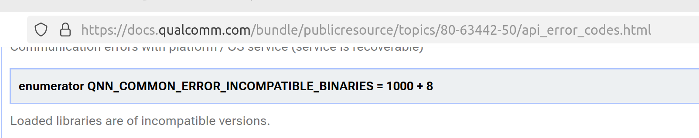

## Qualcomm NPU

### 1. References
#### 1.1 existing supports in mllm
https://github.com/UbiquitousLearning/mllm
https://github.com/UbiquitousLearning/mllm/blob/main/src/backends/qnn/README.md

#### 1.2 Qualcomm documentations
https://www.qualcomm.com/developer/software/qualcomm-ai-engine-direct-sdk
https://docs.qualcomm.com/bundle/publicresource/topics/80-63442-50/introduction.html?product=1601111740009302

### 2. Setup in MNN
https://developer.ridgerun.com/wiki/index.php/Qualcomm_Robotics_RB5/Image_Processing_Software/Fast_CV/Installing_Hexagon_SDK
https://docs.qualcomm.com/bundle/publicresource/topics/80-77512-1/hexagon-dsp-sdk-install-base-sdk-linux.html?product=1601111740010422

Currently the qualcomm compilation to be performed on Linux platform.

The QNN backend relies on the Qualcomm QNN framework and Hexagon SDK to compile LLM-specific operators. Please download them using [QPM3](https://qpm.qualcomm.com/#/main/tools/details/QPM3). The compiling environment only supports Linux now.

Version requirements:
* QNN: [Linux Latest](https://qpm.qualcomm.com/#/main/tools/details/qualcomm_neural_processing_sdk) (about 1GB)
* Hexagon SDK: [Linux 5.5](https://qpm.qualcomm.com/#/main/tools/details/HexagonSDK5.x)  (Some accounts may have no permission to access this SDK and may need to contact Qualcomm for support.) (about 2GB)
* To install lateset Hexagon SDK, `qpm-cli` tool shall be used. Instruction can be referred to `https://docs.qualcomm.com/bundle/publicresource/topics/80-77512-1/hexagon-dsp-sdk-install-addons-linux.html?product=1601111740010422`.
* In terminal `qpm-cli --license-activate hexagonsdk5.x` and `qpm-cli --install hexagonsdk5.x --config codegen/qnn/install.json`

After downloading and installing the two SDKs, copy the SDK directories into the following paths:
* source/backend/qnn/3rd_party/qualcomm_ai_engine_direct_220/
* source/backend/qnn/3rd_party/HexagonSDK/

#### Troubleshooting during setup
Installation cache lies in `/tmp/QIKCache/`, package cache (ndk, jre, ecllipse) lies in `/tmp`, good networking shall be ensured.

### Troubleshooting during library loading
All dependent libraries are needed, besides `libQnnCpu.so` and `libQnnHtp.so`.
