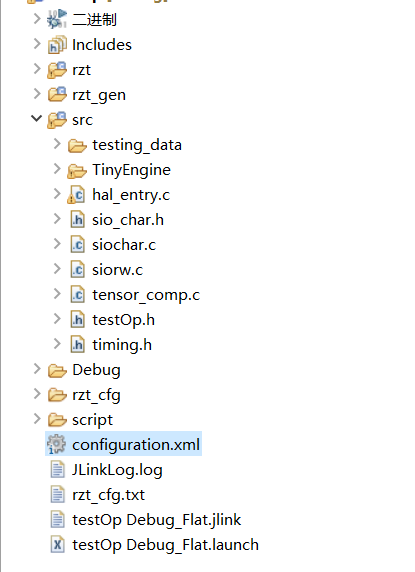
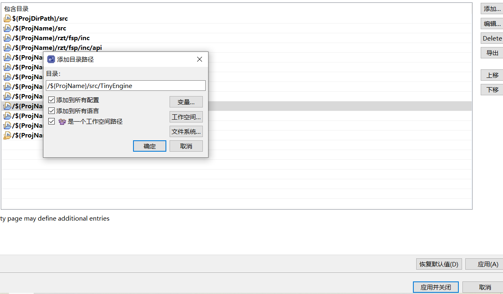
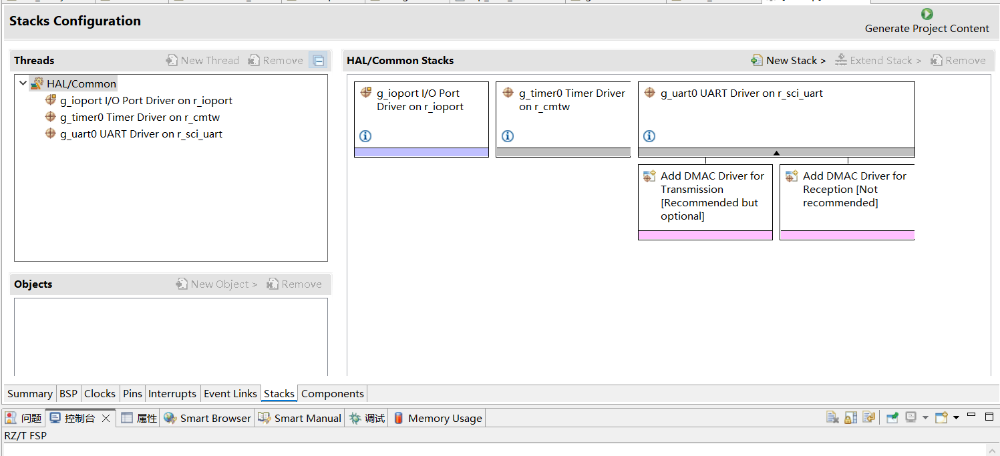
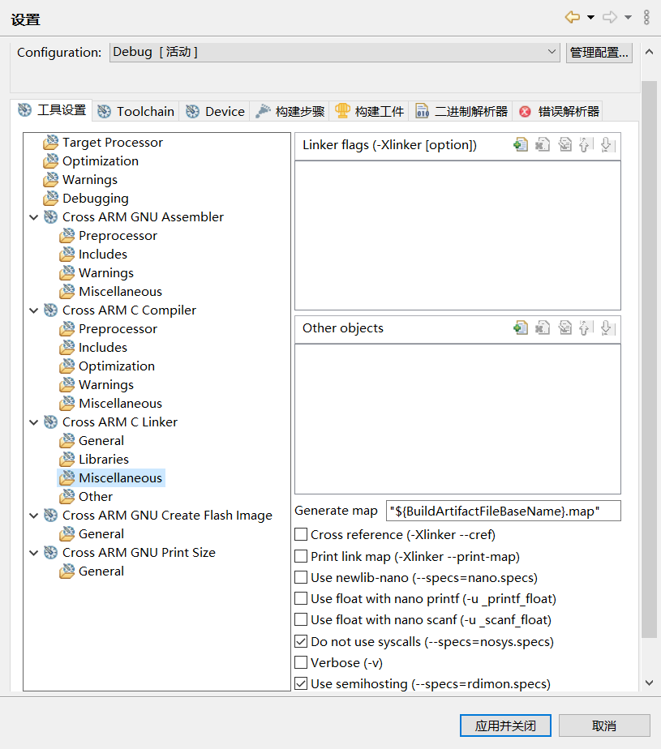

## R-ETE
#### RZ/T2M 开发板深度学习推理引擎使用指南（含代码生成Demo）

### I. 基本环境配置
- 安装对应版本e2studio以及相关FSP: 
（我们使用的是老版本 e2studio-v2023-01, FSP-v1.2.0）
打开网址
[https://github.com/renesas/rzt-fsp/releases/download/v1.2.0/setup_rztfsp_v1_2_0_e2s_v2023-01.exe](https://github.com/renesas/rzt-fsp/releases/download/v1.2.0/setup_rztfsp_v1_2_0_e2s_v2023-01.exe)
， 下载并安装。

- 获取代码可以从我们这里拷贝（也可选从GitHub获取本仓库的最新版本）
```
git clone --recursive https://github.com/huangzhengxiang/R-ETE.git
```

- 安装python依赖包
```
# 安装python依赖
pip install -r requirements.txt
```

### II. 代码生成demo

#### 2.1 代码生成
运行bat文件直接生成C语言代码。代码存储于`.\RZT2M\src`文件夹下。
```
# 项目根目录下生成codegen文件夹
# 生成代码与数据
# 配置其他环境与路径
R-ETE\import_arm_inference.bat
```

#### 2.2 e2studio项目配置
打开e2studio，新建一个RZ/T 的FSP project

1. <b>复制生成的代码</b>
将2.1中生成的代码文件夹`.\RZT2M\src`替换e2studio项目文件夹中的`src`文件夹。
使得代码结构如图所示：
<div align="center">

</div>

2. <b>配置包含路径</b>
添加如下路径，同时勾选全部3个选项（添加到所有配置、添加到所有语言、是一个工作空间路径）
```
/${ProjName}/src/TinyEngine
/${ProjName}/src/TinyEngine/include/arm_cmsis
/${ProjName}/src/TinyEngine/codegen/Include
```
点击`应用`，`应用并关闭`。
具体操作如图：
<div align="center">

</div>

3. <b>配置FSP</b>
这里我们用到了`r_cmtw`作为计时工具，和`r_sci_uart`串口作为通讯工具。
配置后`configuration.txt`应如图所示。
<div align="center">

</div>

4. <b>配置syscall选项</b>
在`C/C++ Settings`中的`Cross ARM C Linker`的`Miscellaneous`项：请勿勾选 `Use newlib-nano (--specs=nano.specs)` ，同时勾选 `Do not use syscalls (--specs=nosys.specs)` 。只有如此，串口通讯才能实现。
<div align="center">

</div>

5. <b>配置加速级别与宏定义</b>
    - 首先，设置编译时优化级别，勾选`-O3`
    <div align="center">
    
    </div>
    - 其次定义宏，必须定义的宏有：
        - `NEON_AARCH32`: 使用此宏定义可以激活NEON寄存器优化。
    <div align="center">
    
    </div>

6. <b>修改内存分配的linker script文件</b>
由于所需内存超过ATCM与BTCM的容量，因此必须指定.data section处于SYSTEM_RAM上。另外，基于性能的考量，也指定.bss section位于SYSTEM_RAM上。指定方式如下图所示（` > SYSTEM_RAM`）：
<div align="center">

</div>

#### 2.3 编译并测试
1. 编译（大约1分钟）

2. 链接RZ/T2M与个人电脑，同时链接串口与个人电脑的USB接口，打开串口显示工具。
串口工具可以选择下载如下第三方工具：
http://www.alithon.com/downloads
也可以下载其他任意工具。
点击开始通讯。

3. 点击`Debug`，可以进行运行。
（需要将pc寄存器设置为0x102060,将cpsr的倒数第二位设置为d）
再点击运行即可。

4. 观察串口调试工具即可看到运行结果

### III. R-ETE代码框架流程简要解析

本代码仓库最为关键部分是`code_generator`文件夹和`RZ/T2M`文件夹。

#### 3.1 code_generator
- `code_generator\CodegenUtilTFlite.py`是推理网络代码生成的核心所在。推理网络代码生成的逻辑过程如下：
    1. 读入并解析指定的`.tflite`文件，获取网络结构信息与参数信息。
    2. 空间分配：为各网络层的参数以及中间结果分配buffer与储存区域。
    这一部分主要是在`code_generator\GeneralMemoryScheduler.py`中实现的。
    3. 代码生成：为各网络层推理运算生成优化算子，这一部分在`code_generator\CodeGenerator.py`进行。
    4. 需要注意的是，每个算子的信息与代码生成策略的代码位于`code_generator\operators`文件夹的各文件中，上述两步作为上层模块大量调用了`code_generator\operators`提供的API。
    （本次针对RZ/T设备的调优也主要针对于这一文件夹中的文件。）

- `code_generator\constant.py`文件中包含了大量常数设定，比如我们新增的`NEON_AARCH32`，用于决定是否针对AARCH32_NEON硬件（即Cortex-R）进行优化。

- `code_generator\codetemplate`该文件夹中包含`depthwise`运算的模板类，我们此次重点重写了`code_generator\codetemplate\depthwiseTemplate.py`中生成`depthwise conv2d`相关算子的代码。

未来算子层面的二次开发可以聚焦于这一部分。

运行这一部分的代码后在本项目根路径生成`codegen`文件夹，包含网络参数、网络结构，以及`depthwise_conv2d`相关算子的源码。

对于生成后的`codegen`文件夹，结构如下：
```
codegen
    |- Include
    |   |- genInclude.h
    |   |- genModel.h
    |- Source
    |   |- genModel.c
    |   |- depthwise_kernel*
    |   |- ...
```

#### 3.2 RZT2M
此文件夹中包含了本项目中有关RZ/T2M+RSK开发板相关内容的指南和源码。
- `RZT2M\generate_arm_inference.bat`是上述demo中运行的Windows batch文件，包含了代码生成的全流程。
- `RZT2M\examples\vww_test.py`是调用3.1中提到的code_generator的入口。
- `RZT2M\packages`包含的几个本demo在RZ/T2M上运行的有关UART和Timer相关的源代码。
- `RZT2M\picture_converter`是本项目代码中生成测试图像的源码。将数据集（0：图中没有人，1：图中有人）放入中`RZT2M\picture_converter\raw_pic`
文件路径采用
    ```
    RZT2M
        |   |- picture_converter
        |   |   |- raw_pic
        |   |   |   |- 0
        |   |   |   |- 1
        |   |   |- convert_picture.py
        |   |   |- tf_validate.py
        |   |- ...
    ```
    运行`RZT2M\picture_converter\convert_picture.py`可以在`RZT2M\picture_converter\testing_data`中可以获得Demo所需要的图片头文件。
    `RZT2M\picture_converter\tf_validate.py`可以用于对比RZ/T2M结果与tf-lite结果，验证程序正确性。
- `RZT2M\TinyEngine`文件夹中包含一系列C语言算子源码，也是算子库的一部分。`RZT2M\TinyEngine\src\kernels`中包含`RZT2M\TinyEngine\src\kernels\fp_requantize_op`是本此优化主要修改的算子库。`RZT2M\TinyEngine\src\kernels\fp_backward_op`是训练算子库，将在未来作进一步优化。