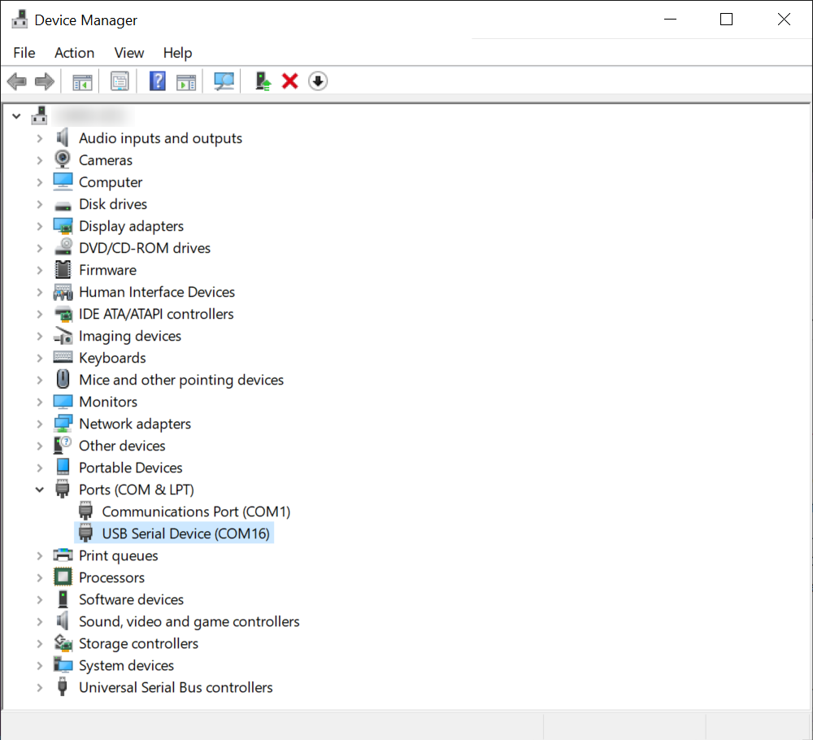
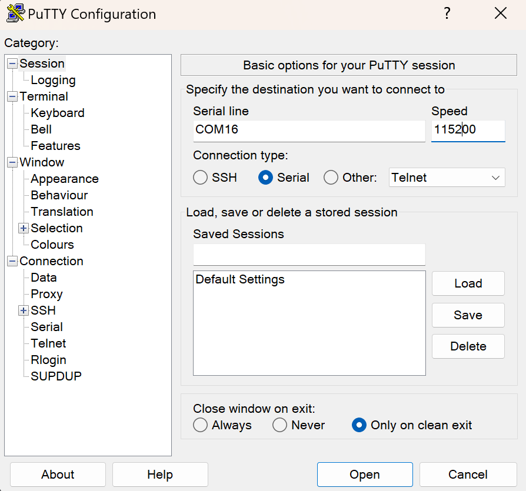

### 0. For System already Exists
#### 0.2.1 serial boot (headless mode, no monitor)
Wiring Instructions, 2 alternatives.

- For Windows.
    1. Locate device COM port in `Device Manager`.
    2. Write down the COM number. 
    <div align="center">
    
    </div>
    3. Download and execute `Putty`.
    https://www.chiark.greenend.org.uk/~sgtatham/putty/latest.html
    4. enter COM number and baud rate into the blanket and open.
    <div align="center">
    
    </div>
    5. Finally, log in.
- For MACOS (Linux).
    1. Before connecting to your Jetson developer kit for initial setup, check to see what Serial devices are already shown on your macOS computer.
    ```bash
    # macOS
    ls /dev/cu.usbmodem*
    # Ubuntu
    ls /dev/ttyACM*
    # or 
    ls /dev/ttyUSB*
    ```
    The new device is your nano.
    2. screen operation.
    ```bash
    # macOS
    sudo screen /dev/cu.usbmodem14133200001053 115200
    # Ubuntu
    sudo screen /dev/ttyACM0 115200
    # or 
    sudo screen /dev/ttyUSB0 115200
    ```


### 1. eSD installation
https://renesas-rz.github.io/rzv_ai_sdk/5.00/getting_started_v2h.html