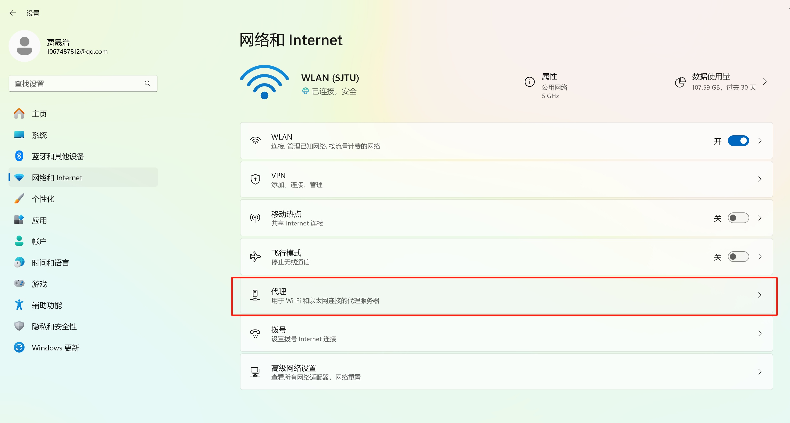
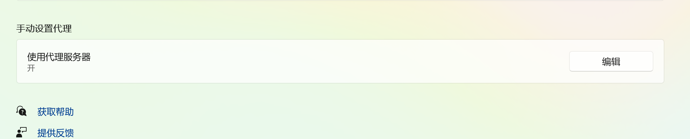
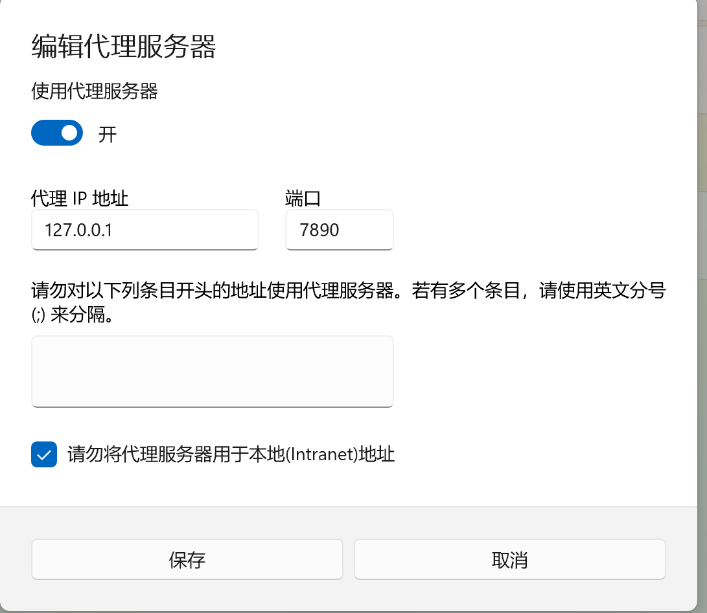
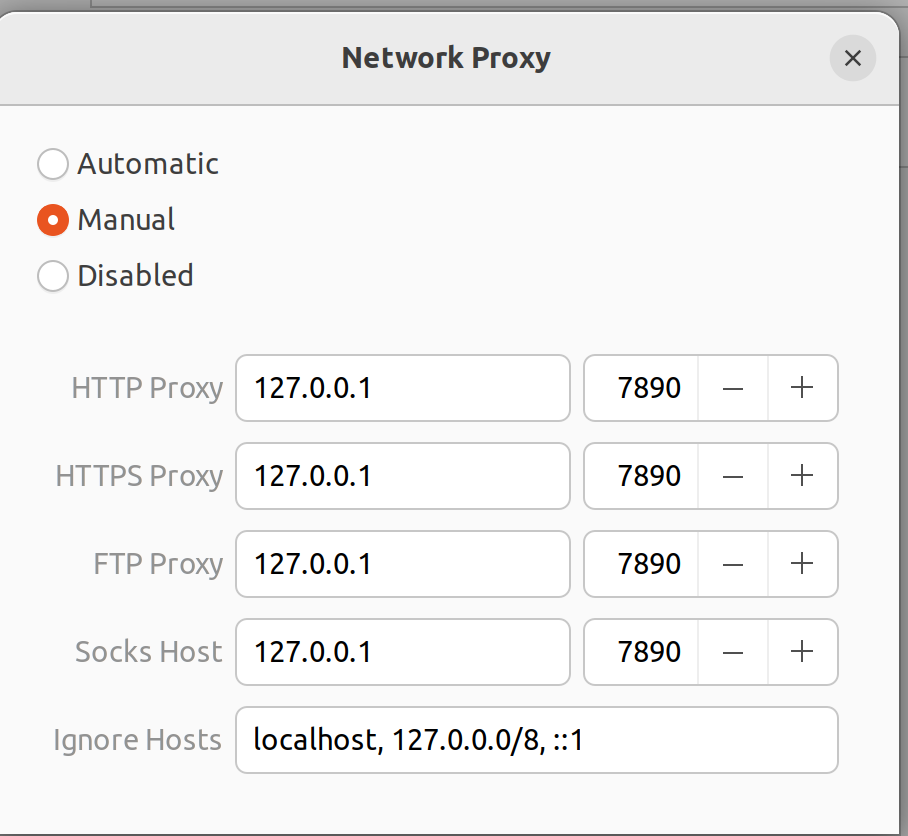

# VPN

## 1. Windows

### 1.1 clash for Windows
clash is a packet transceiver, routing packets from computer to remote VPN server.
https://clashforwindows.org/clash-for-windows-download/

### 1.2 VPN setting
1. Enable proxy on Windows.




2. You buy a URL from some proxy server website (e.g., [mojie](https://mojie.me/)), and copy your URL.

3. Copy your URL into clash `Profiles`, and press download.

4. Try something like google scholar.


## 2. Linux

### 2.1 clash for Linux
Install corresponding version from the release.
https://github.com/doreamon-design/clash/releases
```
mv clash /usr/bin/
```

### 2.2 VPN setting
copy the yaml file to linux machine.
https://doreamon-design.github.io/clash/configuration/getting-started.html
```
clash -f /path/to/yaml
```

## 3. Android

### 3.1 Clash for Android (Clash Meta)
https://github.com/MetaCubeX/ClashMetaForAndroid

Find and get apk in release (arm-v8a)

## 4. macOS

### 4.1 ClashX
https://clashx.org/clashx-official/

## 5. USE PROXY in terminal
```bash
# linux/macOS
export HTTP_PROXY=http://127.0.0.1:7890
export HTTPS_PROXY=http://127.0.0.1:7890
```

```bat
# windows
set HTTP_PROXY=http://127.0.0.1:7890
set HTTPS_PROXY=http://127.0.0.1:7890
```

## 6. Set as system proxy

On Windows/macOS, just find the button and press it.
On Ubuntu, follows the picture settings:

